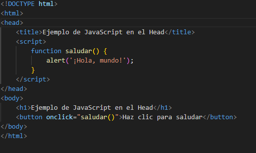
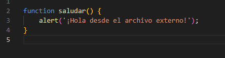
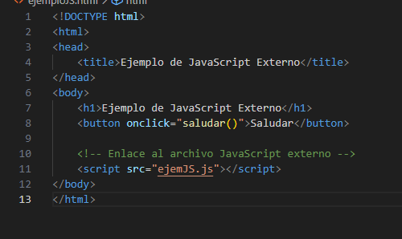

# **Proyecto 1: Explorando los Fundamentos del Desarrollo Web en Entornos de Cliente**

---

## **PARTE 1: Modelos de Programación en Entornos Cliente/Servidor**

### Modelos Cliente/Servidor Comunes
- **Modelo de 2 Capas (2-Tier)**: En este modelo, el cliente se utiliza para la interfaz y presentación, mientras que el servidor se encarga de la lógica de negocios y datos. Esto es adecuado para aplicaciones simples, como el correo electrónico.

- **Modelo de 3 Capas (3-Tier)**: Este modelo agrega una capa intermedia entre el cliente y el servidor, separando la interfaz de usuario y la presentación del procesamiento de la aplicación y la validación de datos. Es útil para aplicaciones más complejas, como sistemas de gestión de inventario.

---
### Modelos Cliente/Servidor Comunes

- **Modelo de N Capas (N-Tier)**: Una extensión del modelo de 3 capas con múltiples capas intermedias según la complejidad de la aplicación. Se utiliza en aplicaciones empresariales grandes.

- **Modelo Cliente/Servidor Peer-to-Peer (P2P)**: En este modelo, no hay un servidor centralizado, y los nodos se comunican directamente entre sí. Se utiliza en redes de intercambio de archivos P2P como BitTorrent.

---

## **PARTE 2: Mecanismos de Ejecución de Código en un Navegador Web**

### Ejecución de JavaScript en un Navegador
- **Configuración de JavaScript en el Navegador**: Se explorará cómo configurar la ejecución de JavaScript en un navegador, utilizando Google Chrome como ejemplo.

- **Compatibilidad entre Navegadores**: Cada navegador interpreta JavaScript de manera diferente. Se analizarán las diferencias y cómo afectan a la ejecución de scripts.

- **Factores de Influencia**: Se considerarán factores como el navegador, el sistema operativo y el dispositivo, que pueden influir en los resultados de la ejecución de JavaScript.

---

### Resolución de Problemas de Compatibilidad
Para abordar problemas de compatibilidad en aplicaciones web en diferentes plataformas, se recomienda el uso de herramientas de prueba multi-navegador, como Comparium. Comparium ofrece pruebas paralelas, compatibilidad con múltiples plataformas y ahorra tiempo y recursos a los desarrolladores al identificar incompatibilidades y proporcionar capturas comparativas.

---

## **PARTE 3: Lenguajes de Programación en Entorno Cliente**

### **Comparación de JavaScript y TypeScript**
La principal distinción es su sistema de tipos, donde JavaScript puede tener errores en tiempo de ejecución, mientras que TypeScript ayuda a detectar errores durante el desarrollo. Además, se explorarán las aplicaciones y casos de uso de cada lenguaje, destacando que JavaScript se utiliza ampliamente en el desarrollo web interactivo, mientras que TypeScript es valioso en proyectos grandes y entornos empresariales.

---

## **PARTE 4: Características de los Lenguajes de Script**

### **Ventajas de la Programación en Lenguajes de Script**
- Eficiencia en desarrollo: Los lenguajes de script requieren menos código y tiempo para tareas, acelerando el desarrollo.
- Sintaxis simple: Su sintaxis es ideal para principiantes y facilita la programación.
- Adaptabilidad en tipos y estructuras: Estos lenguajes son flexibles en términos de tipos de datos y estructuras.
- Amplia comunidad y recursos en línea: Existe una comunidad activa y abundante documentación en línea para resolver problemas.

---

### **Desventajas de la Programación en Lenguajes de Script**
- **Limitaciones en rendimiento**: Los lenguajes de script suelen ser más lentos en tiempo de ejecución, lo que los hace inadecuados para aplicaciones de alto rendimiento.
- **Posibilidad de errores de tipo**: Los problemas de tipo y otros pueden pasar desapercibidos hasta la ejecución.
- **Vulnerabilidad a ataques de seguridad**: Si no se gestionan adecuadamente, los lenguajes de script pueden ser vulnerables a ataques de seguridad.

---

## **PARTE 5: Tecnologías y Lenguajes Asociados. Integración del Código con las Etiquetas HTML**

### **Integración de JavaScript en HTML**
Se explorarán las formas de insertar JavaScript en HTML5, utilizando la etiqueta script. Se discutirá la ubicación recomendada para cargar código JavaScript, ya sea entre las etiquetas head o body. Además, se destacará la ventaja de hacer referencia a archivos JavaScript externos para mantener un código limpio, legible y optimizar el rendimiento del sitio web.

---

### **Creación de una Pequeña Aplicación Web**

---

## **PARTE 6: Herramientas de Programación**

### **Visual Studio Code (VSCode)**

- Ventajas: Potente, personalizable, integración con Git.
- Desventajas: Requisitos de recursos, curva de aprendizaje.
### **Chrome DevTools**

- Ventajas: Depuración en tiempo real, facilidad de uso.
- Desventajas: Limitado a Chrome, dependencia del navegador.
### **Sublime Text**

- Ventajas: Rendimiento rápido, interfaz sencilla.
- Desventajas: Falta de herramientas de depuración integradas, funcionalidad limitada sin extensiones.

---

## **BIBLIOGRAFÍA**

- [ Enlace de los modelos de 2,3 y n capas ](https://www.ionos.es/digitalguide/servidores/know-how/modelo-cliente-servidor/)
-  [ Enlace del modelo P2P ](https://www.ionos.es/digitalguide/servidores/know-how/que-es-p2p-peer-to-peer/)
-  [ Estudio de como ejecutar en el navegador javasript ](https://keepcoding.io/blog/como-ejecutar-el-codigo-de-javascript/)
- [Diferencias entre navegadores cuando se ejecuta javascript](https://www.aprenderaprogramar.com/index.php?option=com_content&view=article&id=783:diferencias-de-navegadores-ante-javascript-firefox-explorer-chrome-safari-javascript-en-linea-cu01108e&catid=78&Itemid=206)
- [Resolución de problemas de compatibilidad en una aplicación web ](https://comparium.app/es/blog/cross-browser-compatibility-issues/#:~:text=Problemas%20de%20compatibilidad%20multi%20navegador%20y%20sus%20soluciones,8%20Falta%20de%20Pruebas%20en%20Dispositivos%20Reales%20)

- [ Lenguajes de progrmacion en entorno cliente, compración de características y aplicaciones ](https://appmaster.io/es/blog/javascript-vs-mecanografiado)
---
- [ Características de los Lenguajes de Script. Ventajas y Desventajas: ](https://www.hostgator.mx/blog/scripting/)
- [Creación de una pequeña aplicación web integrando código JavaScript de diferentes maneras. ](https://www.hostinger.es/tutoriales/insertar-javascript-en-html/#:~:text=Agregar%20JavaScript%20directamente%20a%20un%20archivo%20HTML,-La%20primera%20forma&text=Puedes%20hacerlo%20utilizando%20la%20etiqueta,entre%20las%20etiquetas)

- [ VSCODE ](https://webdesigncusco.com/ventajas-y-desventajas-de-visual-studio-code-2022/)
- [Chrome devtools](https://blog.ida.cl/desarrollo/conoce-los-principales-aspectos-chrome-devtools/)
- [Sublime text ](https://editorsublimetext.blogspot.com/2020/11/ventajas-y-desventajas-del-editor.html)